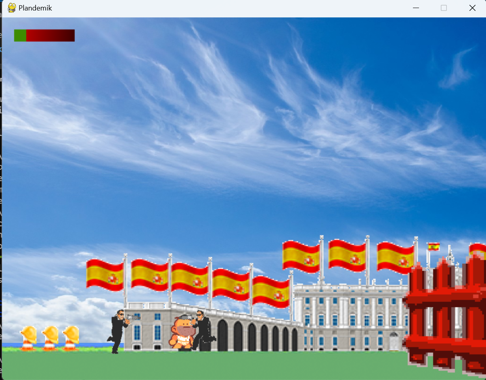

# Plandemik
Videojuego en 2D sobre la pandemia desarrollado en Python usando la librería Pygame. Lo he desarrollado con unos colegas hace un tiempo para aprender a usar esta librería. Vienes por el juego pero te quedas por la historia xD
Recorreremos distintos paises con sus costumbres y nos encontraremos con sus jefes finales. Comienza a salamizar!!!

# Launcher

# Captura del juego

# Ejecución
1. Instalar la librería pygame: pip install pygame
2. En el directorio del main ejecutar: python main.py
